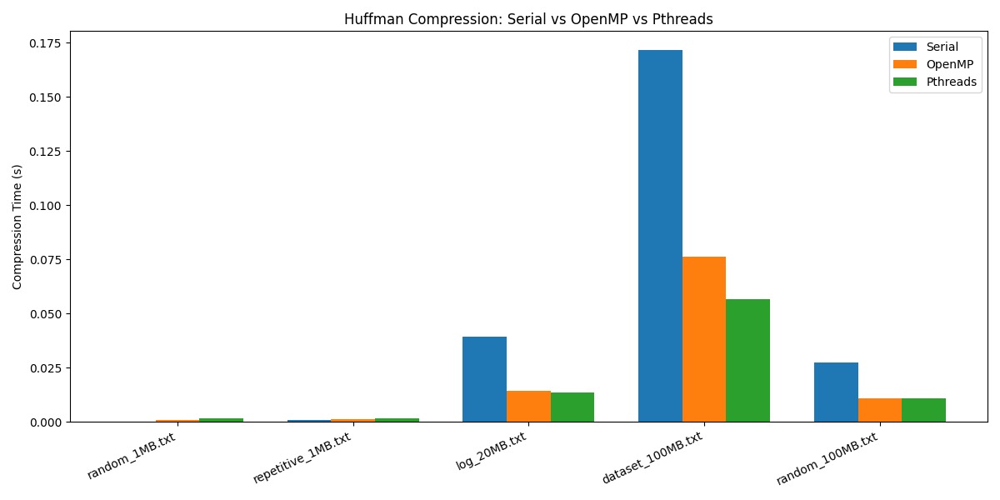

# Huffman Compression Project

This repository contains serial and parallel implementations of Huffman compression using OpenMP and pthreads. 

## Files

- `huffman_serial.c` – Serial Huffman compression
- `huffman_parallel.c` – Parallel Huffman compression
- `run_all.sh` – Script to run all tests
- `*.txt` – Test input files
- `compression_results.txt` – Compression performance results
- `plot.py` – Script to plot compression times

## Usage

Compile the programs:

```bash
gcc -o huffman_serial huffman_serial.c -pthread
gcc -o huffman_parallel huffman_parallel.c -fopenmp -pthread
```

Run all tests:

```bash
./run_all.sh
```

Generate plots:

```
python3 plot.py
```

## Compression Results

| File | Serial (s) | OpenMP (s) | Pthreads (s) |
|------|------------|------------|--------------|
| random_1MB.txt     | 0.000277   | 0.000594   | 0.001413   |
| repetitive_1MB.txt | 0.000760   | 0.001457   | 0.001278   |
| log_20MB.txt       | 0.053796   | 0.020639   | 0.012013   |
| dataset_100MB.txt  | 0.172269   | 0.072009   | 0.066061   |
| random_100MB.txt   | 0.025253   | 0.012364   | 0.010528   |


## Example plot
  
*Figure 1: Huffman compression time comparison*

## Analysis and Inference

From the compression results:

1. **Serial vs Parallel:**  
   - Parallel versions (OpenMP and Pthreads) are generally faster than the serial version, especially for larger files like `log_20MB.txt` and `dataset_100MB.txt`.  
   - For very small files (1MB), the overhead of parallelization may make the serial version slightly faster or comparable.

2. **OpenMP vs Pthreads:**  
   - Pthreads tend to perform slightly better than OpenMP for larger files in this test.  
   - OpenMP shows good scalability but has a small overhead for thread management.

3. **Effect of file type:**  
   - Highly repetitive data (like `repetitive_1MB.txt`) doesn’t benefit much from parallelization because the compression is already very fast.  
   - Larger and more complex datasets show significant speedup with parallel implementations.

**Conclusion:**  
- For small files, serial Huffman compression is sufficient.  
- For large datasets, using parallel implementations (OpenMP or Pthreads) can drastically reduce compression time.  
- Choosing between OpenMP and Pthreads depends on the specific workload and system architecture.
